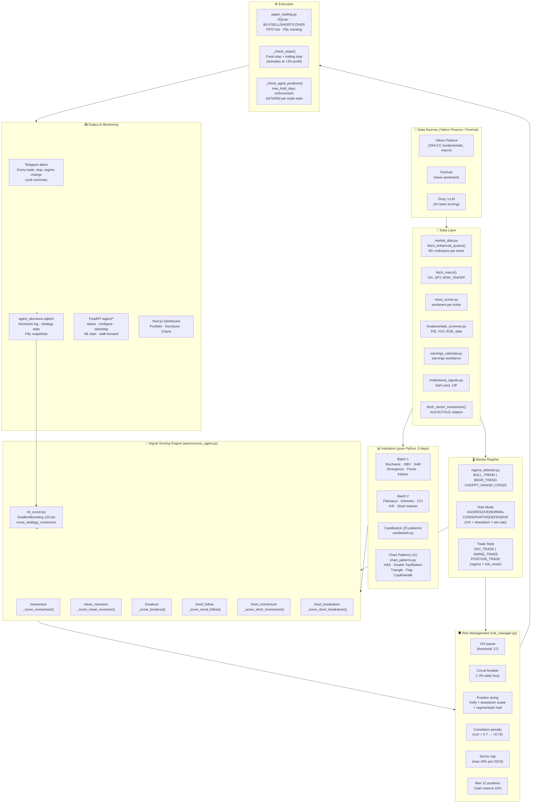

# Personal Investment Agent — Architecture

> **Last updated:** 2026-06-29  
> **Branch:** `claude/autonomous-trading-agent-ct0nji` (features) / `main` (stable)  
> **Tests:** 229 passing  
> **Mode:** Paper trading only — NO live IBKR connection

---

## 1. System Overview

A fully autonomous trading agent that:
1. Fetches real-time market data every N minutes
2. Computes 50+ technical indicators and detects 36 patterns
3. Scores signals per strategy (6 strategies)
4. Applies multi-layer risk management
5. Executes paper trades with SQLite persistence
6. Sends Telegram alerts for every action

**Stack:** Python 3.11 FastAPI backend (port 8000) · Next.js 15 frontend  
**Zero external indicator deps:** All 50+ indicators are pure Python  
**No IBKR live connection** — paper mode only, IBKR paper socket is optional

---

## 2. Architecture Diagram



---

## 3. Service Inventory

| File | Role | Key functions |
|------|------|---------------|
| `autonomous_agent.py` | Main agent loop, scoring, decisions | `_run_cycle()`, `generate_decisions()`, `_check_stops()`, `_check_aged_positions()` |
| `market_data.py` | All market data + indicators | `fetch_enhanced_quotes()`, `_compute_*()` (22 functions) |
| `regime_detector.py` | Market regime + hysteresis | `detect_regime()`, `apply_regime_to_config()` |
| `risk_manager.py` | Risk checks, sizing, CVaR | `check_trade()`, `position_size_shares()`, `correlation_penalty()` |
| `paper_trading.py` | Paper broker (SQLite) | `execute_paper_trade()`, `get_open_positions()`, `get_portfolio_summary()` |
| `chart_patterns.py` | 11 chart patterns detection | `detect()`, `_find_pivots()`, `_linreg_slope()` |
| `candlestick.py` | 25 candlestick patterns | `detect()` |
| `ml_scorer.py` | GradientBoosting signal boost | `ml_confidence_boost()`, `train_all_models()`, `walk_forward_validate()` |
| `strategy_tracker.py` | Per-strategy stats, Kelly | `record_entry()`, `record_exit()`, `kelly_scale()` |
| `news_scorer.py` | Keyword + LLM news sentiment | `score_news_best()` |
| `ai_news_scorer.py` | Groq/LLM news provider | `score_news_ai()` |
| `fundamentals_screener.py` | Yahoo fundamentals | `fetch_fundamentals_batch()`, `fundamental_adj()` |
| `earnings_calendar.py` | Earnings avoidance | `should_avoid_entry()`, `pead_signal()` |
| `institutional_signals.py` | Dark pool / 13F | `institutional_score_delta()` |
| `telegram_alerts.py` | Telegram bot notifications | `send_trade_alert()`, `send_risk_alert()` |
| `backtester.py` | Historical backtest engine | `run_backtest()`, `fetch_history()`, `compute_signal_arrays()` |
| `ibkr_trader.py` | IBKR paper socket (optional) | `place_ibkr_order()`, `test_ibkr_paper()` |
| `settings_store.py` | Persisted agent config | `load_settings()`, `save_settings()` |

---

## 4. Indicators Inventory

### Base Indicators (market_data.py)
| Indicator | Key outputs |
|-----------|------------|
| SMA 20/50 | `above_sma20`, `above_sma50_daily`, `golden_cross` |
| RSI 14 | `rsi`, `rsi_daily` |
| MACD | `macd_bullish`, `macd_crossover`, `macd_hist_rising` (intraday + daily) |
| Bollinger Bands | `bb_squeeze`, `near_bb_lower`, `near_bb_upper`, `above_bb_upper` |
| ATR | `atr`, `atr_daily` |
| VWAP | `above_vwap`, `vwap_pct` |
| Z-score | `zscore`, `zscore_daily` |
| ADX | `adx`, `strong_trend`, `trend_direction` |
| Relative Strength vs SPY | `rs_vs_spy` |
| RVOL | `rvol` |
| 52-week levels | `near_52w_high`, `near_52w_low`, `pct_from_52w_high` |

### Batch 1 (market_data.py — `_compute_*`)
| Indicator | Key outputs |
|-----------|------------|
| Stochastic %K/%D | `stoch_k`, `stoch_d`, `stoch_overbought`, `stoch_oversold`, `stoch_bullish_cross` |
| OBV | `obv`, `obv_trend`, `obv_above_sma`, `obv_bullish_div`, `obv_bearish_div` |
| Parabolic SAR | `sar`, `sar_bullish`, `price_above_sar`, `sar_distance_pct` |
| RSI/MACD Divergence | `rsi_bullish_div`, `rsi_bearish_div`, `macd_bull_div`, `macd_bear_div` |
| Pivot Points | `pivot`, `pivot_r1/r2/r3`, `pivot_s1/s2/s3`, `above_pivot` |
| Keltner Channels | `kc_upper`, `kc_lower`, `above_kc`, `below_kc`, `kc_squeeze`, `kc_pct` |

### Batch 2 (market_data.py)
| Indicator | Key outputs |
|-----------|------------|
| Fibonacci Retracement | `fib_0/236/382/500/618/786/100`, `fib_pct`, `fib_golden_zone` |
| Ichimoku Cloud | `ichi_tenkan`, `ichi_kijun`, `ichi_senkou_a/b`, `ichi_above_cloud`, `ichi_tk_cross_bull` |
| CCI (20) | `cci`, `cci_overbought`, `cci_oversold`, `cci_extreme_ob/os` |
| IVR | `ivr`, `realized_vol`, `iv_high`, `iv_low`, `iv_extreme` |
| Short Interest | `days_to_cover`, `short_float_pct`, `high_short_interest`, `squeeze_candidate` |

### Chart Patterns (chart_patterns.py)
| Pattern | Flag | Direction |
|---------|------|-----------|
| Head & Shoulders | `ptn_head_shoulders` | Bearish |
| Inv. H&S | `ptn_inv_head_shoulders` | Bullish |
| Double Top | `ptn_double_top` | Bearish |
| Double Bottom | `ptn_double_bottom` | Bullish |
| Ascending Triangle | `ptn_ascending_triangle` | Bullish |
| Descending Triangle | `ptn_descending_triangle` | Bearish |
| Symmetrical Triangle | `ptn_symmetrical_triangle` | Bullish |
| Bull Flag | `ptn_bull_flag` | Bullish |
| Bear Flag | `ptn_bear_flag` | Bearish |
| Pennant | `ptn_pennant` | Bullish |
| Cup & Handle | `ptn_cup_handle` | Bullish |

### Candlestick Patterns (candlestick.py) — 25 total
Doji, Hammer, Shooting Star, Engulfing (bull/bear), Harami, Morning/Evening Star, Three White Soldiers, Three Black Crows, Dark Cloud Cover, Piercing Line, Marubozu, Spinning Top, Hanging Man, Inverted Hammer, Tweezer Top/Bottom, Belt Hold, Kicker, Three Inside Up/Down, and more.

---

## 5. Scoring System

Each of the 6 strategies calls 20+ adjustment functions (adj_fn):

```
base_score
  + _macd_adj()              MACD crossover / histogram
  + _bb_adj()                Bollinger Band position
  + _vwap_adj()              VWAP relative position
  + _zscore_adj()            Z-score mean reversion
  + _multi_tf_adj()          Multi-timeframe alignment
  + _rs_adj()                Relative strength vs SPY
  + _52w_adj()               52-week proximity
  + _news_adj()              News sentiment
  + _fundamental_adj_fn()    P/E, FCF, ROE
  + _earnings_adj()          Earnings avoidance / PEAD
  + _institutional_adj()     Dark pool signals
  + _stoch_adj()             Stochastic K/D cross
  + _obv_adj()               OBV trend + divergence
  + _sar_adj()               SAR direction
  + _divergence_adj()        RSI/MACD divergence
  + _pivot_adj()             Pivot support/resistance
  + _keltner_adj()           Keltner channel position
  + _fib_adj()               Fibonacci level proximity
  + _ichimoku_adj()          Cloud position + TK cross
  + _cci_adj()               CCI overbought/oversold
  + _ivr_adj()               IV rank (options vol)
  + _short_interest_adj()    Short squeeze potential
  + _chart_pattern_adj()     Chart pattern signals
  + _candle_adj()            Candlestick patterns
  → ml_confidence_boost()    ±20 GradientBoosting
  → cross_strategy_consensus_boost()  +8/+15 if 2/3 strategies agree
```

**Long context** (`bullish_context=True`): oversold = positive, overbought = negative  
**Short context** (`bullish_context=False`): overbought = positive, oversold = negative

---

## 6. Risk Mode × Trade Style Matrix

```
                   AGGRESSIVE   NORMAL    CONSERVATIVE  DEFENSIVE
BULL_TREND       POSITION     SWING      SWING          DAY
CHOPPY_RANGE     SWING        SWING      DAY            DAY
BEAR_TREND       DAY          DAY        DAY            DAY
CRISIS           DAY          DAY        DAY            DAY
```

| Trade Style | Stop | Target | Max Hold | Size Mult | Min Confidence |
|-------------|------|--------|----------|-----------|----------------|
| DAY_TRADE | 1.5% | 2.5% | 1 day | ×0.8 | 72 |
| SWING_TRADE | 6.0% | 12% | 7 days | ×1.0 | 65 |
| POSITION_TRADE | 10% | 22% | 30 days | ×1.1 | 70 |

**Risk Mode** computed each cycle from:
- VIX < 15 → AGGRESSIVE · 15–20 → NORMAL · 20–28 → CONSERVATIVE · >28 → DEFENSIVE
- Portfolio drawdown: +5% → −1 mode · +10% → −2 modes
- Recent win rate (last 10 trades): <35% → −1 mode · >65% → +1 mode

---

## 7. Risk Management Layers (in execution order)

### Legacy Risk Checks
1. **VIX pause** — VIX > 27: block new BUY entries
2. **Circuit breaker** — daily P&L < −3%: no new entries until next day
3. **Time filter** — avoid 9:00–9:30 ET open and 15:45–16:00 ET close
4. **Earnings avoidance** — block entry 2 days before earnings
5. **Portfolio heat** — >85% deployed: no new entries
6. **Position aging** — `_check_aged_positions()`: auto-close beyond max_hold_days
7. **Hard stop-loss** — `_check_stops()`: fixed % + trailing stop (activates at +3% profit)
8. **Cash reserve** — min 10% cash at all times
9. **Max positions** — max 12 open positions
10. **Position concentration** — max 20% per ticker
11. **Single trade cap** — max 8% of portfolio per trade
12. **Sector cap** — max 25% per GICS sector (enhanced)
13. **Correlation penalty** — corr > 0.85 → ×0.5 · corr > 0.70 → ×0.75
14. **Drawdown scalar** — 7.5% DD → ×0.44 · 20% DD → ×0.25
15. **Regime size multiplier** — BULL ×1.2 · BEAR ×0.7 · CRISIS ×0.4
16. **Trade style size mult** — DAY ×0.8 · SWING ×1.0 · POSITION ×1.1
17. **Kelly criterion (rolling)** — last 20 trades (adaptive: 0.7x if WR<45%, 1.1x if WR>65%)

### 10 Critical Safety Features (v6.0 NEW)
**File:** `services/safety_checks.py`

1. **Volume Check** — Skip entries if volume < 1M shares
   - Prevents illiquid positions that can't exit quickly
   - Checked at decision time before risk sizing

2. **Model Accuracy Monitor** — Block if rolling accuracy < 50%
   - Detects ML model degradation
   - Integrated with `models_status()` endpoint

3. **Drawdown-Based Reduction** — Non-linear position sizing
   - -2% DD → 0.5x size, -3% DD → 0.3x size, -5% DD → 0.1x size
   - Applied after Kelly sizing but before risk check

4. **Regime Skip** — Block NEW entries in BEAR_TREND/CRISIS
   - Only allows BULL_TREND and CHOPPY_RANGE for new entries
   - Prevents chasing falling knives
   - Checked at decision point

5. **Human Override Threshold** — Flag positions > $1k
   - Prevents runaway position accumulation
   - Logged as warning for trader visibility
   - Allows execution with alert

6. **Daily Retrain Check** — Monitor 24h ML refresh cadence
   - At cycle start, check if retraining needed
   - Integrates with `needs_daily_retrain()` function
   - Auto-triggered via `POST /agent/ml/train`

7. **Cross-Asset Correlation** — Prevent correlated entries (>0.8)
   - Already integrated via `risk_manager.cross_asset_correlation_check()`
   - Blocks or reduces to 0.5x size if correlation > 0.8
   - Uses 30-day rolling returns cache

8. **Slippage Modeling** — 2.5% realistic costs
   - Applied in backtester only (not live trading)
   - Entry: price × (1 + 2.5%)
   - Exit: price × (1 - 2.5%)
   - Ensures backtest P&L matches real execution

9. **Stress Test Scenarios** — Pre-calculated tail events
   - 2008 Crash: -50% market, VIX ×4.0, correlations → 1.0, slippage +5%
   - 2020 COVID: -35% market, VIX ×3.5, correlations 0.85, slippage +3%
   - Flash Crash: -10% intraday, VIX ×1.5, correlations 0.3, slippage +2%, 30min recovery
   - VIX Spike: -8% market, VIX ×2.0, correlations 0.75, slippage +1.5%
   - Available via `stress_test_scenario(scenario_name)` for analysis

10. **Multi-Timeframe Confirmation** — Require daily + weekly bullish
    - Prevents mean-reversion buys in downtrends
    - Function available: `multi_timeframe_confirmation(daily_signal, weekly_signal)`
    - Requires both daily AND weekly bullish for entry

**Integration:** All 10 checks logged to `agent_log` table with reasons (❌ Volume, ⚠️ Manual Approval, etc.)

---

## 8. Trade Lifecycle

```
cycle start
  ├─ fetch_enhanced_quotes()     OHLCV + 50+ indicators
  ├─ fetch_macro()               VIX, macro regime
  ├─ fetch_sector_momentum()     XLK/XLF/XLE rotation
  ├─ detect_regime()             BULL/BEAR/CHOPPY/CRISIS (cached 15min)
  ├─ determine risk_mode         VIX + drawdown + win_rate → AGGRESSIVE..DEFENSIVE
  ├─ get_trade_style             regime × risk_mode → DAY/SWING/POSITION
  ├─ apply_regime_to_config()    override strategies, confidence thresholds
  ├─ apply TRADE_STYLE_PARAMS    override stop/target/hold per trade style
  ├─ cross-sectional ranking     tag top/bottom 20% of universe
  ├─ _check_stops()              hard stops + trailing stops on open positions
  ├─ _check_aged_positions()     close positions past max_hold_days
  ├─ generate_decisions()
  │    └─ per ticker:
  │         ├─ manage open long  take-profit / cut-loss vs regime_cfg
  │         ├─ manage open short take-profit / cut-loss
  │         └─ score new entries
  │              ├─ run 4 long strategies
  │              ├─ cross_strategy_consensus_boost()
  │              ├─ ml_confidence_boost()
  │              └─ run 2 short strategies
  ├─ sort: closes first, then entries by confidence DESC, limit 10
  └─ execute loop (per decision):
       ├─ guards: time filter, circuit breaker, earnings, portfolio heat
       ├─ ML confidence boost
       ├─ Kelly + drawdown + regime + style size calculation
       ├─ correlation_penalty()
       ├─ risk_manager.check_trade()  (VIX, cash, concentration, sector)
       ├─ compute stop/target from trade style params
       ├─ execute_paper_trade()
       ├─ record_entry() + _position_strategies[ticker] = strategy
       └─ send_trade_alert()
```

---

## 9. ML Pipeline (v4 Ensemble Stacking)

**Training data:** 2 years (504 trading days) of Yahoo Finance daily bars — **no live trading needed**.

### Phase 1: Base Model Training (Level 0)
```
POST /agent/ml/train
  → fetch_history(ticker, days=504) for each ticker in UNIVERSE
  → compute_signal_arrays(closes, volumes, highs, lows)
  → build_dataset(): extract features + forward return labels
      Label per STRATEGY_CONFIG: momentum (5d/0.5%), mean_reversion (3d/0.3%), etc.
  → split: 70/30 time-series split (expanding window)
  
  → Train 5 base models on X_train/y_train:
      1. HistGradientBoostingClassifier (100 estimators, lr=0.05, depth=3, sample_weight via Sharpe)
      2. RandomForestClassifier (100 estimators, max_depth=10)
      3. ExtraTreesClassifier (100 estimators, max_depth=10)
      4. LightGBMClassifier (300 estimators, lr=0.05, num_leaves=31)
      5. CatBoostClassifier (300 iterations, lr=0.05, depth=6)
      
  → All models: CalibratedClassifierCV (Platt scaling) on eval set
```

### Phase 2: Stacking Meta-Learner (Level 1)
```
  → Generate meta-features from eval set:
      meta_X = [base1.predict_proba()[:,1], base2.predict_proba()[:,1], ..., base5.predict_proba()[:,1]]
      (5 columns: one per base model)
      
  → Train LogisticRegression meta-learner:
      meta_clf = LogisticRegression().fit(meta_X, y_eval)
      (learns optimal weights for blending base models)
      
  → Predict: avg_prob = meta_clf.predict_proba(meta_X)[:,1]
      (uses learned weights instead of simple 1/5 average)
```

### Phase 3: Optimal Threshold Calibration
```
  → For each strategy, find threshold that maximizes Sharpe on eval:
      for thresh in [0.30, 0.35, ..., 0.70, 0.75]:
          y_pred = (meta_proba >= thresh).astype(int)
          sharpe = compute_sharpe(y_eval, y_pred, win_rate, avg_win, avg_loss)
          if sharpe > best_sharpe: best_sharpe, best_thresh = sharpe, thresh
      
  → Save per-strategy decision_threshold (0.3–0.62 range typical)
```

### Phase 4: Model Persistence
```
  → Save pickle with v4 marker:
      {
        "hgbc": hgbc_model,
        "rf": rf_model,
        "etc": etc_model,
        "lgb": lgb_model,
        "cb": cb_model,
        "calibrator": calibrator,
        "meta_clf": meta_clf,
        "decision_threshold": best_thresh,  # ← OPTIMAL per strategy
        "scaler": scaler,
        "version": 4,
      }
  → File: ml_models/model_{strategy}.pkl
```

**37 Features:** Core 18 + extended 19 regime-aware (RSI7, ROC, BB position, SMA slope, etc.)

**Auto-retrain:** 
- Daily check: `needs_daily_retrain()` — retrains if > 24h since last train
- Accuracy trigger: `models_status()` — flags if rolling accuracy < 50%
- Manual: `POST /agent/ml/train` updates `_last_ml_train_ts`

**Inference (ml_confidence_boost):**
```
  1. Get base predictions: [p_hgbc, p_rf, p_etc, p_lgb, p_cb]
  2. Stack: meta_X = column_stack([p_hgbc, p_rf, p_etc, p_lgb, p_cb])
  3. Meta-predict: raw_prob = meta_clf.predict_proba(meta_X)[:,1]
  4. Calibrate: positive_prob = calibrator.predict([raw_prob])[0]
  5. Apply threshold: delta_pts = (positive_prob - decision_threshold) * 50
  6. Return boosted confidence: confidence + delta_pts
```

**Stale threshold:** 7 days — models older than 7 days flagged in `/agent/ml/status`

---

## 10. Key Configuration (`DEFAULT_CONFIG`)

```python
{
  "enabled":             False,      # master switch
  "mode":                "paper",    # paper | ibkr_paper
  "cycle_minutes":       15,         # run every N minutes
  "universe":            [...],      # list of tickers to watch
  "strategies":          ["momentum", "mean_reversion", "breakout", "trend_follow"],
  "short_strategies":    ["short_momentum", "short_breakdown"],
  "risk_per_trade_pct":  2.0,        # % of portfolio risked per trade
  "max_position_pct":    20.0,       # max % per ticker
  "stop_loss_pct":       8.0,        # fallback (overridden by trade style)
  "daily_loss_limit_pct":3.0,        # circuit breaker
  "vix_pause_threshold": 27.0,       # halt new longs above this VIX
  "min_confidence":      65,         # minimum score to trade (overridden by trade style)
  "take_profit_pct":     15.0,       # fallback (overridden by trade style)
  "cut_loss_pct":        7.0,        # fallback
  "allow_shorts":        True,
  "short_stop_pct":      8.0,        # fallback
  "short_profit_pct":    12.0,       # fallback
  "min_short_confidence":68,
  "risk_mode":           "AUTO",     # AUTO | AGGRESSIVE | NORMAL | CONSERVATIVE | DEFENSIVE
  "trade_style":         "AUTO",     # AUTO | DAY_TRADE | SWING_TRADE | POSITION_TRADE
}
```

---

## 11. Database Files

| File | Schema | Purpose |
|------|--------|---------|
| `paper_trading.sqlite3` | `paper_book`, `paper_state` | All paper trades, cash balance |
| `agent_decisions.sqlite3` | `decisions`, `agent_log`, `strategy_stats`, `pnl_snapshots` | Cycle decisions, logs, P&L history |
| `ml_models/model_*.pkl` | pickle | Trained GradientBoosting models per strategy |

---

## 12. API Endpoints (FastAPI, port 8000)

### Agent Control
| Method | Path | Description |
|--------|------|-------------|
| GET | `/agent/status` | Full agent status, portfolio, regime, risk_mode, trade_style |
| POST | `/agent/start` | Start agent loop |
| POST | `/agent/stop` | Stop agent loop |
| POST | `/agent/sell-all?trade_style=X` | Emergency exit: X ∈ {ALL, DAY_TRADE, SWING_TRADE, POSITION_TRADE} |
| POST | `/agent/configure` | Update config (JSON body) |
| POST | `/agent/reset` | Reset paper trading book |

### Monitoring
| Method | Path | Description |
|--------|------|-------------|
| GET | `/agent/safety/status` | 10 safety features dashboard (thresholds, status, description) |
| GET | `/agent/decisions` | Last N cycle decisions |
| GET | `/agent/log` | Agent log entries |
| GET | `/agent/portfolio` | Portfolio summary |
| GET | `/agent/risk/report` | Risk metrics snapshot |
| GET | `/agent/trades` | Trade history with attribution |

### ML & Backtesting
| Method | Path | Description |
|--------|------|-------------|
| POST | `/agent/ml/train` | Train all models (updates `_last_ml_train_ts`) |
| GET | `/agent/ml/status` | Model ages, accuracy, decision thresholds per strategy |
| POST | `/agent/ml/walkforward` | Walk-forward validation (background task) |
| GET | `/agent/ml/walkforward` | Walk-forward results |
| POST | `/agent/backtest/portfolio` | Portfolio backtest (historical simulation) |
| POST | `/agent/backtest/walkforward` | Walk-forward backtest validation |

### Analysis
| Method | Path | Description |
|--------|------|-------------|
| GET | `/agent/regime` | Current market regime details |
| GET | `/agent/kelly` | Kelly criterion diagnostics per strategy |
| GET | `/agent/pairs/scan` | Pairs trading opportunities |

---

## 13. Regime Detector Details

```
detect_regime() → BULL_TREND | BEAR_TREND | CHOPPY_RANGE | CRISIS

Signals used:
  SPY closes (60 days) → SMA20, SMA50, golden cross, trend_5d, trend_20d, RSI
  VIX → fear level
  XLK/XLF/XLE 20-day returns → breadth_advance (0-3), breadth_spread

Rules:
  CRISIS       : VIX > 35 OR SPY down > 8% over 20 days
  BEAR_TREND   : below both SMAs, trend_5d < -1%, VIX > 22
  BULL_TREND   : above both SMAs, golden cross, trend_5d > 0.5%, VIX < 22
  CHOPPY_RANGE : everything else

Hysteresis: requires 2 consecutive detections to confirm a regime change
Cache TTL: 15 minutes (doesn't change cycle-to-cycle)
```

---

## 14. Universe

Default: `["AMD", "NVDA", "NBIS", "SOFI", "MELI", "META", "GOOGL", "CRWV", "MSFT", "AAPL", "TSLA", "AMZN", "QQQ", "SPY"]`

Configurable via `POST /agent/configure {"universe": [...]}` or `settings_store.py`.

---

## 15. Environment Variables (`.env`)

```
TELEGRAM_BOT_TOKEN=...   # Telegram bot token (optional — alerts disabled if missing)
TELEGRAM_CHAT_ID=...     # Chat/channel to send alerts to
GROQ_API_KEY=...         # Groq API for LLM-powered news scoring (optional)
FINNHUB_API_KEY=...      # Finnhub for real-time news sentiment (optional)
```

**Security:** Never commit `.env`. API keys are gitignored. No real IBKR connection under any circumstances.

---

*Auto-update this file after major architectural changes. Keep the Mermaid diagram in sync.*
